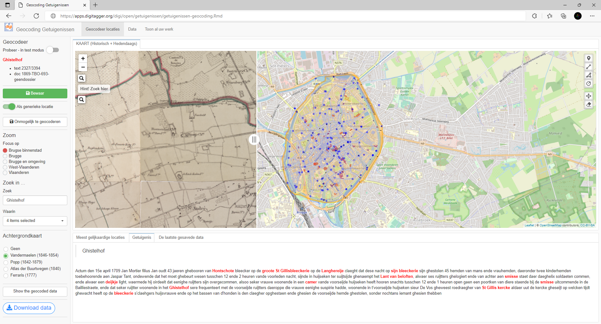

*Historical geocoder*: Identify places of interest in 18th-19th century

- Upload texts with identified places, indicate the corresponding location in the the app
- Similarities (suggestions show similar place at specific geo-level)
  - Communes, Streets, Places of Interest in Bruges
  - Can draw own lines/polygons/areas
- Background maps based on WMTS services Vlaanderen: Ferraris, VanderMaelen, Popp, Atlas Buurtwegen, current Openstreetmap
- Data in PostgreSQL/PostGIS

    
    
> Note: the shapefiles and data of this app are not made public

